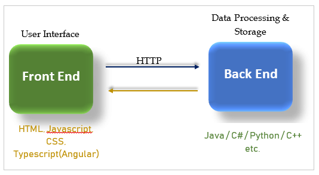
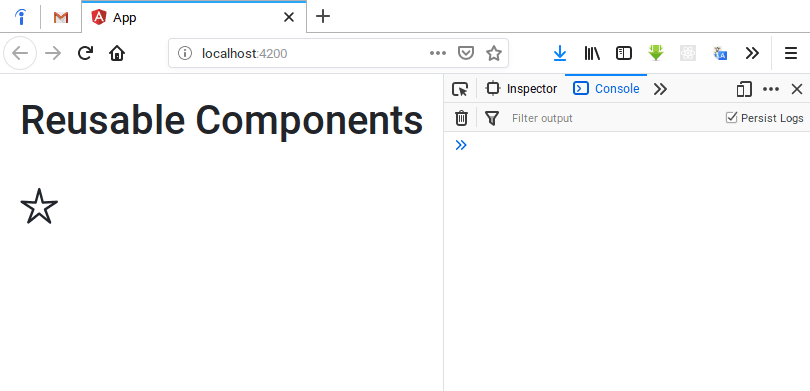
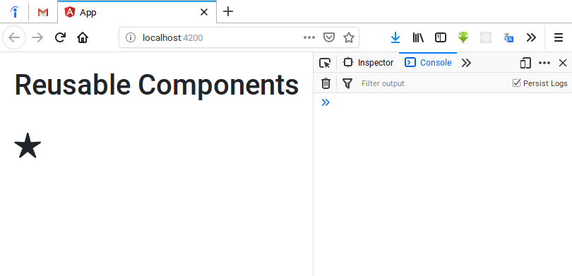
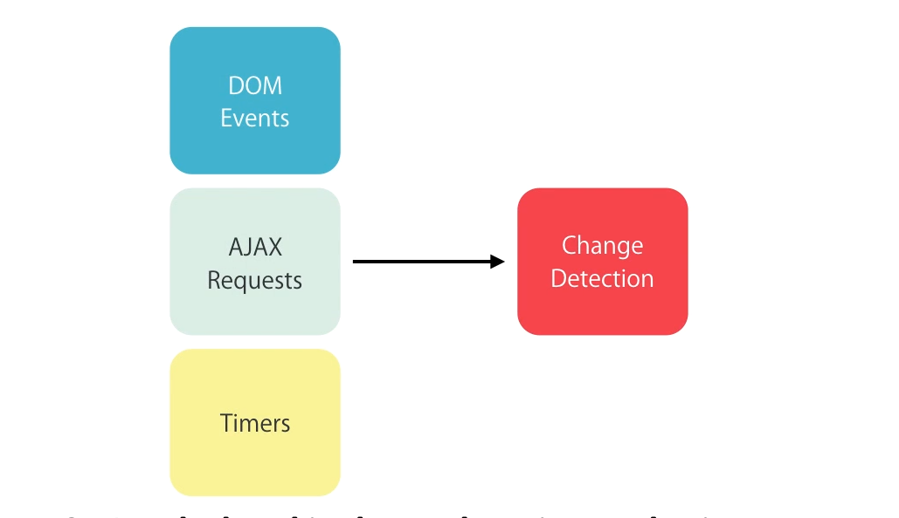
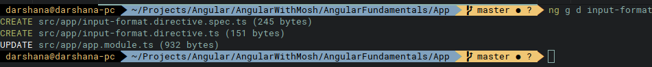
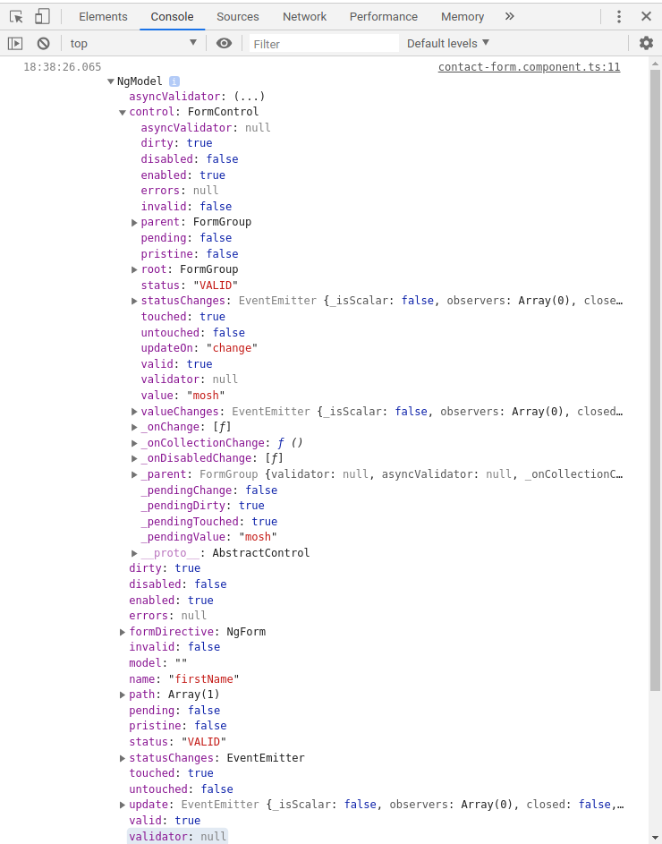
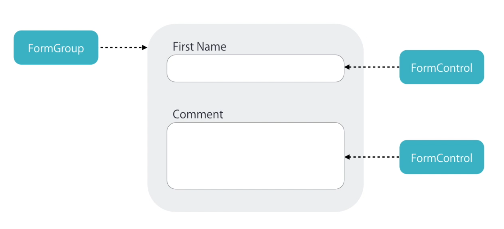
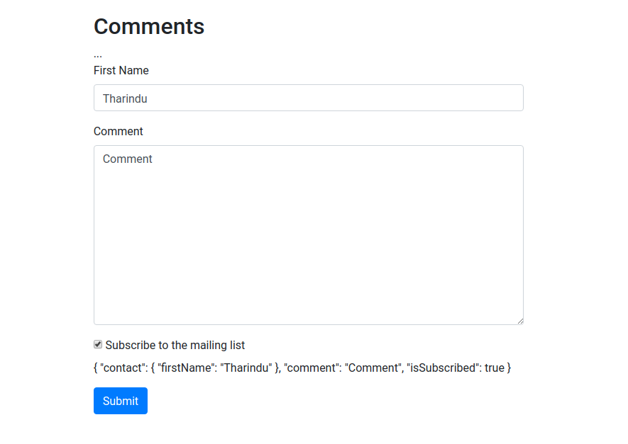
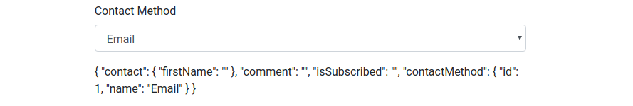
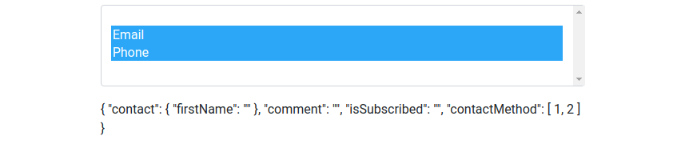

# The Complete Angular Course

## Introduction

### What is Angular JS ?

A framework for building client applications in HTML, CSS, and JavaScript/Typescript

### Why Angular JS ?

When an application become more and more complex, the structure become more complex and hard to maintain. Therefore, as a successful alternative to vanilla JavaScript application, Angular JS can be used to avoid those obstacles.

### Angular JS Benifits

* Gives our application a clean loosely-coupled structure. Easy to understand and maintain.
* Include a lot of reusable code. 
* Introduce more testability. Easy to write automated tests.

## Architecture of Angular Application



Front end : User Data, Presentation logic.

Back end : Database, Processing Data

## Configurations

Node JS. https://nodejs.org

```bash
node --version					# Required minimum NPM version for Angular, v6.9
```

```bash
npm install -g @angular/cli	 	# Install Angular CLI
```

```bash
ng --version					# View Angular version in the console
```

New Project

```bash
ng new <name>					# create a new project named <name>
```

User VS code. https://code.visualstudio.com

Load application

```bash
ng serve -o  					# Serve the app and deploy it in the default web browser
```


**Angular, Angular 2 or Angular 4**

Angular 1 changed completely from Angular 2.


## Typescript Fundamentals

Typescript - A super set of JavaScript (Any supported JS code is also supported in Typescript)

* Strong typing (Static typing)
* Object oriented features - Classes, Access modifiers
* Compile time errors
* Great tools.

### Using Typescript

##### Install TypeScript

```bash
npm install -g typescript
```

The above command will install TypeScript globally (`-g`).

##### Execute TypeScript

```bash
tsc --target es5 filename.ts && node filename.js
```

This command will transpile TypeScript file into JavaScript file and will execute it using node. `--target es5` is for use ECMA script 5 features in the TypeScript file.


## Angular Components

A component encapsulate the data, HTML markup and view logic. Angular defines component based architecture. Angular application is a tree of components. Module is a container for group of components.

**Steps to create and use a component**

* **Create** a component
* **Register** it in a module
* Add an element in an **HTML markup**

## Angular Services


## Angular Data Binding

### Property Binding

We can use property binding to bind **properties of the DOM** as below using `[]`. 

```html
 
```

Here we can use **interpolation** also to set `src` property. But instead using the above property binding is better.

```html

```

Actually, above interpolation is a syntactical sugar. Behind the scene, when angular compiles the templates it translate these interpolations into property bindings. With property binding, we bind a property of a DOM element, to a field where property in our component.

```typescript
@Component({
    selector: 'courses',
    template: ``
})
export class CoursesComponent {
    imageUrl = "http://lorempixel.com/400/200/"
}
```

In the above example `src` property of the `img` DOM element is binded with the `imageUrl` attribute of the `CoursesComponent`.

Even though string interpolation works here, its better to use property binding with DOM element properties. With text elements using interpolation is the better way. 

```html
<h2 [textContent]="title"></h2>
```

But property binding can be used with text also as the above `h2` text content binding.

> **Property binding is only one way . It works only from component to the DOM.**

If we update something in the DOM, component won't be updated. We have to use two way binding for that.


#### DOM vs HTML document

**DOM is a model of objects that represents structure of a document**. Its a **tree of objects in memory**. **HTML is a markup language that we used to represent the DOM in text**. When the browser parses an HTML document, it creates a tree of objects in memory that they refer to as the DOM. We can create that object tree using JavaScript too. But using HTML is far simpler.

**Most of the attributes in the HTML elements has one to one mapping with DOM objects**. But **there are few exceptions**. Some DOM properties are not represented in the HTML attributes and vise versa.  Hence when implementing property binding its better to be careful.


##### HTML Attribute that don't have representation in the DOM

```html
<table>
    <tr>
    	<td [colspan]="colspanOfData"></td>
    </tr>
</table>
```

When we parse this HTML markup, it'll create a actual DOM object. But that DOM object doesn't have property called `colspan`. Thats why the error below pops in the browser console.

```
Error: Template parse errors:
Can't bind to 'colspan' since it isn't a known property of 'td'. ("
        <table>
            <tr>
                <td [ERROR ->][colspan]="colspanOfData"></td>
            </tr>
        </table>
"): ng:///AppModule/CoursesComponent.html@11:20
```


##### DOM attributes that doesn't have representation in the HTML

```javascript
<h1 [textContent]="title"></h1>
```

Here, `textContent` DOM property doesn't have representation in the HTML.


> **When using property binding, actually binding to a property of a DOM object. Not into a attribute of a  HTML element.**

But in 99% cases DOM object properties and HTML element attributes has one to one mapping. There are fewer exceptional scenarios.

### Attribute Binding

To fix the above error, we should say Angular to target the HTML element's attribute rather than targeting a DOM object property as follows that will fix the issue.

```html
<table>
    <tr>
    	<td [attr.colspan]="colspanOfData"></td>
    </tr>
</table>
```

This is called attribute binding.

#### Add bootstrap

The following command will download and install bootstrap and save it into `node_modules` folder and also `--save` will add it as a dependency by adding it to the `package.json`.

```bash
npm install bootstrap --save
```


```json
"dependencies": {
    ...
    "@angular/router": "~7.2.0",
    "bootstrap": "^4.3.1",
    ...
  },
```

Here, the Bootstrap version is showing as `^4.3.1`. That refers to **major.minor.patch** numbers.

****


****

`^` (carrot) character means we can use the most recent major version. According to the above image, we can use 3.4, 3.5, 3.9. But if there is a newer version like version 4 or 5, we are not going to install that through `npm install`.

Why we need to add this to the `package.json`. Because when we using version controlling, we don't need `node_packages` folder there. Instead we simply add `package.json` to the remote repository. Then when someone clones it, and before deploying, he can download all the dependencies for that project via `package.json`. It simply save the space.

And then import bootstrap into the project as follows.

```scss
@import "~bootstrap/scss/bootstrap.scss";		/* 	SCSS 	*/
```

```css
@import "~bootstrap/dist/css/bootstrap.css";	/* 	CSS 	*/
```

Afterwards, we can use bootstrap inside our templates in the regular Bootstrap way as follows.

```typescript
@Component({
    selector: 'courses',
    template: `
        <button class="btn btn-primary">Primary Buttons</button>
    `
})
```


### Class Binding

Angular's, class binding is used to bind the classes into DOM elements dynamically. This is a subset of property binding.

```typescript
@Component({
    ...
    template: `
        <button class="btn btn-primary" [class.active]="isActive">Primary Buttons</button>
    `
    ...
})
export class CoursesComponent {
    isActive = true
}
```

```html
<button class="btn btn-primary active">Primary Buttons</button>
```

According to the above code, only if `isActive` is true, `button` will be added with `active` class. If `isActive` is false then `active` class won't be added into the element. 


> [JavaScript false and true conditions](https://developer.mozilla.org/en-US/docs/Glossary/Truthy)
>
> In JavaScript, a **truthy** value is a value that is considered  `true` when encountered in a boolean context. All values are truthy unless they are defined as falsy (i.e., except for `false`, `0`, `""`, `null`, `undefined`, and `NaN`).
>
> JavaScript uses type [coercion](https://developer.mozilla.org/en-US/docs/Glossary/Type_Conversion) in Boolean contexts.
>
> Examples of *truthy* values in JavaScript (which will be coerced to true in boolean contexts, and thus execute the `if` block):
> ```js
> if (true)
> if ({})
> if ([])
> if (42)
> if ("0")
> if (new Date())
> if (-42)
> if (12n)
> if (3.14)
> if (-3.14)
> if (Infinity)
> if (-Infinity)
> ```


### Style Binding

Angular will use style binding to apply CSS styles dynamically into DOM elements as follows. This is also a variation of property binding. We can use [DOM style objects properties](https://www.w3schools.com/jsref/dom_obj_style.asp) in style binding.

```html
<button [style.backgroundColor]="isActive ? 'blue' : 'grey' ">Primary Buttons</button>
```

Note, that there is `''` for the applying string style attribute values. 

### Event Binding

Event binding is used to bind events with the component. In the below code snippet, buttons click event is attached with `onSave` function of the component. `$event` is the event objects, that is passed as a input argument to the method. 

```typescript
@Component({
    selector: 'courses',
    template: `
        <button (click)="onSave($event)">Primary Buttons</button>
    `
})
export class CoursesComponent {
    ...

    onSave($event){
        console.log("Button Clicked!", $event)
    }
}
```

#### Event Bubbling & preventing

Event bubbling is the standard event propagation mechanism in the DOM. It will start from the child and propagate to the parent and so on.

```typescript
@Component({
    selector: 'courses',
    template: `
        <div (click)="clickDiv()">
            <button (click)="onSave($event)">Primary Buttons</button>
        </div>
    `
})
export class CoursesComponent {
    
    onSave($event){
        console.log("Button Clicked!", $event)
    }

    clickDiv(){
        console.log("Div Clicked!")
    }
}
```

Above example will propagate event as follows. 

```
Button Clicked! 
Div Clicked!
```

To prevent event prorogation, we can change the method as follows using `$event.stopPropagation()` standard JS method.

```javascript
 onSave($event){
 	$event.stopPropagation();
 	console.log("Button Clicked!", $event)
 }
```


#### Event Filtering

Event filtering is used to filter events when implementing event binding. According to the following example, `(keyUp.enter)` event filter is used, instead of `(keyUp)` event and filtering `enter` event at the component method afterwards.

```typescript
@Component({
    selector: 'courses',
    template: `
    	<h1 [textContent]="title"></h1>
    	<h2>{{subTitle}}</h2>
        <input (keyUp.enter)="onKeyUp()"/>
		// <input (keyUp)="onKeyUp($event)"/> Not This
    `
})

export class CoursesComponent {
    title = "Angular"
    subTitle = "Event Filtering"
    
    // Use this.
    onKeyUp(){
        console.log("ENTER has pressed!")
    }
    
    // Not this.
    onKeyUp($event){
        if ($event.keyCode === 13){
            console.log("ENTER has pressed!")
        }
    }
}
```

#### Template Variables

Access the value of the element

**Use the `$event` object**

```typescript
import { Component } from '@angular/core'

@Component({
    selector: 'courses',
    template: `
    	<h1 [textContent]="title"></h1>
    	<h2>{{subTitle}}</h2>
        <input (keyUp.enter)="onKeyUp($event)"/>
    `
})
export class CoursesComponent {
    title = "Angular"
    subTitle = "Using $event Object to pass the value"
	// pass the standerd event object to access value of the element.
    onKeyUp($event){
        console.log($event.target.value)
    }
}
```

**Using the template variable**

Here, instead of passing `$event` object to the method, we refer that element by using a template variable `#email`. Then, the value of that variable is passed to the method as input argument.

```typescript
import { Component } from '@angular/core'

@Component({
    selector: 'courses',
    template: `
    	<h1 [textContent]="title"></h1>
    	<h2>{{subTitle}}</h2>
        <input #email (keyUp.enter)="onKeyUp(email.value)"/>
    `
})
export class CoursesComponent {
    title = "Angular"
    subTitle = "Template Variable to pass the value"

    onKeyUp(email){
        console.log(email)
    }
}
```


### Two way binding

Alternative way for two way binding using `$event` object expression.

```typescript
import { Component } from '@angular/core'

@Component({
    selector: 'courses',
    template: `
        <input [value]="email" (keyUp.enter)="email = $event.target.value; onKeyUp()"/>
    `
})
export class CoursesComponent {
    
    email = "do@angular.com"

    onKeyUp(){
        console.log(this.email)
    }
}
```

Standard way using `@NgModel` directive. Here `[(ngModel)]="email"` defines the two way binding of the `email` field of the component.  

```typescript
import { Component } from '@angular/core'

@Component({
    selector: 'courses',
    template: `
        <input [(ngModel)]="email" (keyUp.enter)="onKeyUp()"/>
    `
})
export class CoursesComponent {
    
    email = "do@angular.com"

    onKeyUp(){
        console.log(this.email)
    }
}
```

If there is a error like follows, its because we need to import forms module, because its where `@NgModel` is available.

```
Error: Template parse errors: Can't bind to '(ngModel))' since it isn't a known property of 'input'. (" <input [value]="email" (keyUp.enter)="email = $event.target.value; onKeyUp()"/>
```

```typescript
import { BrowserModule } from '@angular/platform-browser';
import { FormsModule} from '@angular/forms';

@NgModule({
  ...
  imports: [
    BrowserModule,
    FormsModule
  ],
  ...
})
export class AppModule { }

```

### Pipes

**Angular pipes is used to format the data for the view**. There are built in pipes for  Uppercase, Lowercase, Decimal, currency, percent. Also we can create custom pipes.

```typescript
import { Component } from '@angular/core'

@Component({
    selector: 'courses',
    template: `
        <h3>{{course.title | uppercase | lowercase }}</h3><br>  // Apply multiple pipes
        {{course.students | number }}<br>						// Rounding of the Number
        {{course.rating | number:'2.1-1' }}<br>					// Leading zero, Rounding
        {{course.price | currency:'AUD':true:'3.2-2' }}<br>		// Price format
        {{course.releaseDate | date:'shortDate'}}				// Date Format
    `
})
export class CoursesComponent {
    title = "Angular Pipes"
    course = {
        title: "The complete Angular Course",
        rating: 4.9745,
        students: 23456,
        price: 190.49,
        releaseDate: new Date(2019, 8, 1)
    }
}
```


#### Custom pipes

Create a new file for the pipe. In this case `summary.pipe.ts` as below is created for a pipe that take text content and summarize them for a given length. Here, we use `Pipe`  decorator and `PipeTransform` interfaces from the core and we implement it's `transform` it in our custom pipe.

```typescript
import {Pipe, PipeTransform} from '@angular/core'

@Pipe({ name: 'summary'})
export class SummaryPipe implements PipeTransform {
    transform(value: string, limit?: number){   
        if(!value) return null
        let actualLimit = (limit) ? limit : 50
        return value.substring(0, actualLimit) + ' ...'
    }
}
```


> ##### Insight into Angular Pipes
>
> Pipe decorator has 2 properties, `name`, `pure`.
>
> | Option                                          | Description                                                  |
> | ----------------------------------------------- | ------------------------------------------------------------ |
> | [`name`](https://angular.io/api/core/Pipe#name) | <small>`name: string`  The pipe name to use in template bindings. </small> |
> | [`pure`](https://angular.io/api/core/Pipe#pure) | <small>`pure: boolean` When true, the pipe is pure, meaning that the `transform()` method is invoked only when its input arguments change. Pipes are pure by default. <br>If the pipe has internal state (that is, the result depends on state other than its arguments), set `pure` to false. In this case, the pipe is invoked on each change-detection cycle, even if the arguments have not changed.</small> |
>
> We need to implement `PipeTransform` interface when we create a pipe. This interface has only one method, `transform`.
>
> ```typescript
> interface PipeTransform {
> transform(value: any, ...args: any[]): any
> }
> ```
>
> ###### Parameters
>
> | Field | value | args  | Returns |
> | ----- | ----- | ----- | ------- |
> | Type  | any   | any[] | any     |
>
> <small>Refer [Angular.io | Pipes](https://angular.io/guide/pipes) for more about pipes. </small>

We can use above created `summary` pipe as below. First we need to import the custom pipe into our module in order to use it.

```typescript
...
import { SummaryPipe } from './summary.pipe';

@NgModule({
  declarations: [
    ...,
    SummaryPipe
  ],
  imports: []
  ...
```

Then we can use it in our component.

```typescript
import { Component } from '@angular/core'

@Component({
    selector: 'courses',
    template: `
        {{paragraph | summary:100}}
    `
})
export class CoursesComponent {
    paragraph = "Lorem ipsum dolor sit amet, consectetur adipiscing elit, sed do eiusmod tempor incididunt ut labore et dolore magna aliqua. Ut enim ad minim veniam, quis nostrud exercitation ullamco laboris nisi ut aliquip ex ea commodo consequat. Duis aute irure dolor in reprehenderit in voluptate velit esse cillum dolore eu fugiat nulla pariatur. Excepteur sint occaecat cupidatat non proident, sunt in culpa qui officia deserunt mollit anim id est laborum."
}
```

This will output summery result in the web browser as below.


## Building Reusable Components 

In order to make component more reusable, we want to add bunch of input and output properties. We use input properties pass input to the state of the component. We use output properties to raise events from this custom components. **The combination of input and output properties for a component**, make up the **public API of that component**. 


#### Declaring Input Properties

##### Using `@Input()` decorator

First import `Input ` from `@angular/core` library and define input fields or properties like below.

```typescript
import { Component, OnInit, Input } from '@angular/core';

@Component({
  selector: 'app-favorite',
  templateUrl: './favorite.component.html',
  styleUrls: ['./favorite.component.scss']
})
export class FavoriteComponent implements OnInit {
  
  @Input() isFavourite:boolean  
  // Decorator in angular making fields & Properties as Input properties for a component
}
```

Then we can use it inside **parent container** **as a input property to the current component**.

```html
<app-favorite [isFavourite]="post.isFavourite" (change)="onChangeUpdate()"></app-favorite>
```


##### Using `inputs` property of the Component

```typescript
import { Component, OnInit } from '@angular/core';

@Component({
  selector: 'app-favorite',
  templateUrl: './favorite.component.html',
  styleUrls: ['./favorite.component.scss'],
  inputs: ['isFavourite']
})
export class FavoriteComponent implements OnInit {
  
  	isFavourite:boolean  
    // Decorator in angular making fields & Properties as Input properties for a component
	// ...
}
```

But there is a problem with this approach, even though this way has less code and less imports. 

> ##### Working Code
>
> <small>**favourite.component.html**</small>
>
> ```html
> <p [textContent] = "isSelecetd? '&#x02605;' : '&#x02606;'" (click)="onClick()"></p>
> ```
>
> <small>**app.component.html**</small>
>
> ```html
> <h1>Reusable Components</h1>
> <app-favorite [isFavourite]="post.isFavourite" (change)="onChangeUpdate()"></app-favorite>
> ...
> <!-- Usage with alias (label) -->
> <app-favorite [is-favourite]="post.isFavourite" (change)="onChangeUpdate()"></app-favorite>
> ```
>
> <small>**faviourite.component.ts**</small>
>
> ```typescript
> import { Component, OnInit, Input } from '@angular/core';
> 
> @Component({
> selector: 'app-favorite',
> templateUrl: './favorite.component.html',
> styleUrls: ['./favorite.component.scss']
> })
> export class FavoriteComponent implements OnInit {
> 
> @Input('is-favourite') isFavourite:boolean	// 'is-favourite' is a alias (like a label)
> isSelecetd: boolean = false
> 
> constructor() { }
> 
> ngOnInit() {}
> 
> onClick(){
>  this.isSelecetd = !this.isSelecetd
> }
> 
> }
> ```

**Note** : Using alias is the best practice because, with code refactoring it wont affect on the HTML template. Even though `isFavourite` variable changes.  

#### Declaring Output Properties

As the following code, we can create an event named `change` and refer it in the parent component as `onFavoriteComponentChange` with the correct camel case. In this child component, when user clicks on the HTML element,  it will trigger an event via `this.change.emit();` in the parent component.

<small>**favorite.component.ts**</small>

```typescript
import { ..., EventEmitter } from '@angular/core';

@Component({
  selector: 'app-favorite',
  templateUrl: './favorite.component.html',
  styleUrls: ['./favorite.component.scss']
})
export class FavoriteComponent implements OnInit {
  ...
  @Output() change = new EventEmitter();
  @Output() click = new EventEmitter();

  ...

  onClick(){
    this.isSelecetd = !this.isSelecetd
    this.change.emit();
    this.click.emit();
  }

}
```

<small>**app.component.ts**</small>

 ```typescript
import { Component } from '@angular/core';

@Component({
  selector: 'app-root',
  templateUrl: './app.component.html',
  styleUrls: ['./app.component.scss']
})
export class AppComponent {
  post = {
    title: "Title",
    isFavourite: true
  }

  // Bind to chanage of the child
  onFaviouriteChange(){
    console.log('Faviourite changed!')
  }

  // Bind to click of the child
  onFaviouriteClick(){
    console.log('Faviourite clicked!')
  }
}
 ```

<small>**app.component.html**</small>

```html
<h1>Reusable Components</h1>
<app-favorite [is-favourite]="post.isFavourite" (change)="onFaviouriteChange()" (click)="onFaviouriteClick()"></app-favorite>
```

This will pass an event from the child to the parent up to the hierarchy.




#### Pass data with events

We can optionally pass some value when emitting the event `this.change.emit(<optional> value);`. Then it will available to all the subscribers. In this case `app` component.

<small>**favorite.component.ts**</small>

```typescript
...
export class FavoriteComponent implements OnInit {
  
  @Output() change = new EventEmitter();

  isSelecetd: boolean = false
  
  onClick(){
    this.isSelecetd = !this.isSelecetd
    this.change.emit(this.isSelecetd);
  }
}
```

<small>**app.component.ts**</small>

```typescript
export class AppComponent {
  ...
  onFaviouriteChange(isFavourite){
    console.log(`isFaviorite: ${isFavourite}`)
  }
}
```

<small>**app.component.html**</small>

```html
<app-favorite [is-favourite]="post.isFavourite" (change)="onFaviouriteChange($event)"></app-favorite>
```

In the HTML file we need to pass standard event object in order to use event passing like this way.



In order to more structure the code and for the compile time checking of the passing argument, we can introduce a interfaces for the passing object. We can define it in the required component and import it.

<small>**favorite.component.ts**</small>

```typescript
import { Component, OnInit, Input, Output, EventEmitter } from '@angular/core';

@Component({
  selector: 'app-favorite',
  templateUrl: './favorite.component.html',
  styleUrls: ['./favorite.component.scss']
})
export class FavoriteComponent implements OnInit {
    
  // Alias for 'change' -> 'change-click' and 
  // we can refer it in the app component event as (change-click) in the angular way
    
  @Output('change-click') change = new EventEmitter(); 

  isSelecetd: boolean = false
  
  onClick(){
    this.isSelecetd = !this.isSelecetd
    this.change.emit({ newValue: this.isSelecetd });
  }
}

// Interfcae for the output object wrapping
export interface FaviouriteChangesEvenetArgs {
  newValue: true
}
```

<small>**app.component.ts**</small>

```typescript
...
import { FaviouriteChangesEvenetArgs } from './favorite/favorite.component';
...
export class AppComponent {
  ...
  onFaviouriteChange(eventArgs: { newValue:FaviouriteChangesEvenetArgs}){
    console.log('isFaviorite: ', eventArgs)
  }
}
```

The output result would be the same as before but with more structured code.

#### Templates

```typescript
@Component({
  selector: 'app-root',
  templateUrl: './app.component.html',
  template: `
		<h2> Header </h2>
	`
  styleUrls: ['./app.component.scss']
})
```

We can use either `templateUrl` or in place template with `template` property of a component. There is no separate requests to the server for HTML's because they are already bundled and delivered with `main.bundle.js`. Its better to use in place template if you have 5 or less lines of code. Otherwise using external HTML template is the better way.

#### Styles

There are three ways to apply styles  to a component.

* **Use `styleUrls` in the component.** If you are using a theme put it first in the array followed by other styles.
* **Use `styles` and in place styling.**
* **Put styles in the HTML component using `<style>` tags.** 

```typescript
@Component({
  selector: 'app-root',
  templateUrl: './app.component.html',
  template: `
		<h2> Header </h2>
	`
  styleUrls: ['./app.component.scss'],
  styles:[
      `
      	backgroud: red;
      `
  ]
})
```

**Style applying precedence**

If you define multiple styles for the same element, from `styleUrls`, `styles` whichever defines last will be take ignoring the previous ones completely. If you define styles using on the template using `<style>`, it will be applied regardless of other styles and which are not defined in the template will be picked from the other styles which is defined in `styleUrls` or `styles`. **These styles only applied to the elements of the components**. 

**Shadow DOM**

**Allows us to apply scoped styles to elements without bleeding out to the outer world.** 

```javascript
var el = document.querySelector('favourite');
var root = el.createShadowRoot();
root.innterHTML = `
	<style> h1 { color: red } </style>
	<h1> Hello </h1>
`;
```

Here we create a `shadowRoot` and apply element styles to that root. This won't leak the styles to the outside elements. 

**View encapsulation of the Angular** : `ViewEncapsulation.Emulated` will bring shadow DOM into the Angular.

```typescript
@Component({
  selector: 'app-root',
  templateUrl: './app.component.html',
  styleUrls: ['./app.component.scss'],
  encapsulation: ViewEncapsulation.Emulated
})
```

`ViewEncapsulation.Native` is used to use the native shadow DOM if available.  If you lack of library like bootstrap, import it there, but it will introduce performance problems.

```typescript
encapsulation: ViewEncapsulation.None 
```

will introduce style bleeding. 


#### `ngComponent`

We can use the `ngComponent` to inject the content to a child component as follows.

<small>**panel.component.ts**</small>

```html
<div class="panel panel-default">
  <div class="panel-heading">
    <!-- Content will be replace this -->
    <ng-content select=".heading"></ng-content>
  </div>
  <div class="panel-body">
    <!-- Content will be replace this -->
    <ng-content select=".body"></ng-content>
  </div>
</div>
```

The above `.heading` and `.body` selectors will be subjected to the replacements with the below content based on the CSS selector from the parent `app.component.html`. If you have only one `ng-content` you won't need the selector.

<small>**app.component.html**</small>

```html
<bootstrap-panel>
    <div class="heading">Heading</div>
    <div class="body">
        <h2>Body</h2>
        <p>Some content here ... </p>
    </div>
</bootstrap-panel>
```


#### `ngContainer`

We can use pass only the content using `ng-container` as follows.

```html
<bootstrap-panel>
    <ng-container class="heading">Heading</ng-container>
    <ng-container class="body">
        <h2>Body</h2>
        <p>Some content here ... </p>
    </ng-container>
</bootstrap-panel>
```

**This will only pass the content of the tag without the tag**. In the previous example we pass the data with the tag.


## Angular Directives

There are two type of inbuilt directives in the Angular JS.

* Structural Directives
* Attribute Directives

### Structural Directives

#### `ngIf` Directive

This is used to hide and show content based on some condition evaluation.

<small>**app.component.ts**</small>

```typescript
import { Component, ViewEncapsulation } from '@angular/core';
import { FaviouriteChangesEvenetArgs } from './favorite/favorite.component';

@Component({
  selector: 'app-root',
  templateUrl: './app.component.html',
  styleUrls: ['./app.component.scss'],
  encapsulation: ViewEncapsulation.Emulated
})
export class AppComponent {
  courses = [1, 2]
}
```

<small>**app.component.html**</small>

```html
<div *ngIf="courses.length>0">
    List of Courses
</div>
<div *ngIf="courses.length==0">
    No courses Yet
</div>
```

If the condition that evaluated is truthy, it will be added to the DOM, otherwise it will be **removed from the DOM**. 


##### If and Else like approach using templates 

<small>**app.component.html**</small>

```html
<div *ngIf="courses.length > 0; else noCourses">
    List of Courses
</div>
<ng-template #noCourses>
    No courses Yet
</ng-template>
```

`courses.length > 0; else noCourses` will map to the `#noCourses` template if evaluation comes to the else condition. Hence, it will show the named template.

Or use following fully template approach. 

```html
<div *ngIf="courses.length > 0; then coursesList else noCourses"></div>
<ng-template #coursesList>
    Courses List
</ng-template>
<ng-template #noCourses>
    No courses Yet
</ng-template>
```


##### Using Hidden attribute

```html
<div [hidden]="courses.length == 0">
    List of Courses
</div>
<div [hidden]="courses.length > 0">
    No courses Yet
</div>
```

The main difference is that this approach will hide the HTML after rendering it. Its an additional workload to the computer. Its good to use `ngIf` for large tree of child elements, also angular going detect changes even for this hidden elements too. But in some situations, building large sub tree will be costly. Then you can build it prior point and hide it for later using HTML `hidden` property.


#### `ngSwitch Case ` Directive

This is used when we need multiple matching scenarios.

<small>**app.component.html**</small>

```html
<ul class="nav nav-pills nav-fill">
    <li class="nav-item" [class.active]="viewMode=='map'"><a (click)="viewMode='map'">Map View</a></li>
    <li class="nav-item" [class.active]="viewMode=='list'"><a (click)="viewMode='list'">List View</a></li>
</ul>

<div [ngSwitch]="viewMode">
    <div *ngSwitchCase="'map'">Map View Content</div>
    <div *ngSwitchCase="'list'">List view Component</div>
    <div *ngSwitchDefault>Otherwise</div>
</div>
```

<small>**app.component.html**</small>

```typescript
import { Component } from '@angular/core';

@Component({
  selector: 'app-root',
  templateUrl: './app.component.html',
  styleUrls: ['./app.component.scss']
})

export class AppComponent {
    viewMode = 'map'
}
```


#### `ngFor` Directive

This directive is used to render list of objects.

<small>**app.component.html**</small>

```html
<ul>
    <li *ngFor="let course of courses; index as i; even as isEven">
        {{i}} - {{ course.name }} -- <span *ngIf="isEven">(EVEN)</span>
    </li>
</ul>
```

This has set of in built attributes.

##### `ngFor` and Change Detection

<small>**app.component.ts**</small>

```typescript
import { Component } from '@angular/core';

@Component({
  selector: 'app-root',
  templateUrl: './app.component.html',
  styleUrls: ['./app.component.scss']
})

export class AppComponent {
    viewMode = 'map'
    courses = [
      { id:1, name: 'course1' },
      { id:2, name: 'course2' },
      { id:2, name: 'course3' },
    ]

    onAdd(){
      this.courses.push({ id:3, name: 'course4' },)
    }
    
    onRemove(course){
      this.courses.splice(this.courses.indexOf(course), 1);
    }
}
```

<small>**app.component.html**</small>

```html
<button (click)="onAdd()">Add</button>
<ul>
    <li *ngFor="let course of courses">
        {{ course.name }}
        <button (click)="onRemove(course)">Remove</button>
    </li>
</ul>
```

This will add a new course to the list and it will immediately be displayed in the web page. Angular will detect the change and do the rendering of the component for us automatically. Angular change detection will fire in below events.



##### Optimizing `ngFor` for Complex Markups

<small>**app.component.html**</small>

```html
<button (click)="onAdd()">Add</button>
<ul>
    <li *ngFor="let course of courses; trackBy: trackCourses">
        {{ course.name }}
        <button (click)="onRemove(course)">Remove</button>
    </li>
</ul>
```

The problem is Angular tracks objects not by its content. Hence, when we reloading the objects list, it will re render the DOM for all the available objects. This is costly. To avoid that, we can provide custom attribute the track objects using `trackBy` keyword as above.

<small>**app.component.ts**</small>

```typescript
export class AppComponent {
    viewMode = 'map'
    courses;

    loadCourses(){
      this.courses = [
        { id:1, name: 'course1' },
        { id:2, name: 'course2' },
        { id:2, name: 'course3' },
      ]
    }

    trackCourse(index, course){
      return course ? course.id : undefined
    }
}
```

Here, this `course` object list will be tracked by id instead of the default object identity. Therefore re-rendering will not be happen for the component list.  Its better to use it wherever it needs to render complex markup.

##### Leading asterisk `*` in Angular 

Its going to re-write the markup using angular template and property.

```html
<div *ngIf="courses.length > 0; then coursesList else noCourses"></div>
<ng-template #coursesList>
    Courses List
</ng-template>
<ng-template #noCourses>
    No courses Yet
</ng-template>
```

It will convert above code into below code. But its better to left the hard work for the Angular itself, rather then doing it manually.

```html
<div *ngIf="courses.length > 0; else noCourses"></div>
<ng-template [ng-If]="courses.length > 0">
    Courses List
</ng-template>
<ng-template [ng-If]="!(courses.length > 0)">
    No courses Yet
</ng-template>
```


#### `ngClass` directive

This is an attribute directive, that can be used to change attributes of the DOM elements.

```html
<span
    class="glyphicon"
    [class.glyphicon-star]="isFavourite"
    [class.glyphicon-star-empty]="!isFavourite"
    ></span>
```

The above code can be easily re-write using `ngClass`. If the argument is evaluated as true, its going to add that as a style class. Otherwise it wont be rendered.

```html
<span
    class="glyphicon"
    [ngClass]="{
        'glyphicon-star': isFavourite,
        'glyphicon-star-empty': !isFavourite
    }"
    ></span>
```


#### `ngStyle` directive

```html
<button
    [style.backgroundColor]="canSave ? 'blue': 'gray'"
    [style.color]="canSave ? 'white': 'black'"
    [style.fontWeight]="canSave ? 'bold':'normal'"
>Save</button>
```

Instead of the multiple CSS conditional styles, we can use `ngStyle` to apply it all-together in more concise way.

```html
<button
    [ngStyle] = "{
        'backgroundColor' : canSave ? 'blue': 'gray',
        'color' : canSave ? 'white': 'black',
        'fontWeight' ? canSave ? 'bold':'normal'
    }"
>Save</button>
```


#### Safe Traversal Operator

When we implementing real world applications some objects wont be available at the starting point. Therefore, application wont be able to access the attributes of the objects. In this case we can use `ngIf` or `?` operator.

<small>**app.component.ts**</small>

```typescript
export class AppComponent {
    task = {
      title: 'Review Application',
      assignee: {
        name: 'John Smith' 
      }
    }
}
```

<small>**app.component.html**</small>

```html
<span *ngIf='task.assignee'>{{task.assignee.name}}</span>
```

or use `?` as below.

```html
<span>{{task.assignee?.name}}</span>
```

This won't output an error in the console if that particular object is not available. 

### Custom Directives

We can use custom directive to have more control over behavior of DOM elements. We can pass the data to custom directives using input properties. If that directive has only one input property, we can use selector of that property as the alias of that property and simplify the usage of the custom directive. And we can use `HostListener` decorator to subscribe events that happens on host DOM object.

**Creating a custom directive using CLI**

```bash
ng g d <directive name>
```

The above command of the Angular CLI will generate a custom component as below and it will automatically registered in the base module's  `declarations`.



The default boilerplate code for the custom directive will be like below.

```typescript
import { Directive } from '@angular/core';

@Directive({
  selector: '[appInputFormat]'
})
export class InputFormatDirective {

  constructor() { }

}
```


The following code section shows how to use it in a HTML template. The commented section showing that how to infer a scenario that using the custom directive selector as an alias of that property, if that directive has only one input property.

```html
<input type="text" appInputFormat [format]="'uppercase'">

<!-- <input type="text" [appInputFormat]="'uppercase'"> -->
```

<small>**input-format.directive.ts**</small>

```typescript
import { Directive , HostListener, ElementRef, Input} from '@angular/core';

// HostListener : Allow to Subscribe to the evenets from the  host that hold this directive

@Directive({
  selector: '[appInputFormat]'
})
export class InputFormatDirective {

  @Input('format') format;
   
  // @Input('appInputFormat') format;  // [appInputFormat]="'uppercase'"

  constructor(private el:ElementRef) { }

  @HostListener('focus') onFocus(){
    console.log("on Focus")
  }

  @HostListener('blur') onBlur(){
    let value:string = this.el.nativeElement.value;
    if(this.format== 'lowercase'){
      this.el.nativeElement.value = value.toLowerCase()
    } else {
      this.el.nativeElement.value = value.toUpperCase()
    }
  }
}

```

The above code shows the implementation of that custom directive.


## Template-driven Forms in Angular

Create a `contact-form` component  using Angular CLI as below. And add the following markup to create the initial HTML-Bootstrap form component.

<small>**commands to create the from**</small>

```bash
ng new template-driven-forms		# Create a new Angular Project
cd template-driven-forms	
npm install bootstrap --save		# Install Bootstrap
ng g c contact-form					# Create a component named, contact-form
```

<small>**contact-form.component.html**</small>

```html
<form>
  <div class="form-group">
      <label for="firstName"></label>
      <input ngModel name="firstName" id="firstName" type="text" class="form-control">
  </div>
  <div class="form-group">
    <label for="comment"></label>
    <textarea ngModel name="comment" id="comment" cols="30" rows="10" class="form-control"></textarea>
  </div>  
  <button class="btn btn-primary">Submit</button>
</form>
```

In the template driven approach, we apply `ngModel` directive to our input field, and Angular will automatically create an instance of form control class `FormControl` and associate with that input field under the hood. That name attribute will take as the key for the input field value. 

To observe the `ngModel` object we follow the below procedure to log it on to the console.

<small>**contact-form.component.html**</small>

```html
<div class="form-group">
      <label for="firstName"></label>
      <input ngModel name="firstName" #firstName="ngModel" (change)="log(firstName)" id="firstName" type="text" class="form-control">
</div>
...
```

<small>**contact-form.component.ts**</small>

```typescript
...
export class ContactFormComponent {
  log(x){
    console.log(x)
  }
}
```

And it will show the `ngModel` object in the console as in the following image. 



  Here we can clearly see that `NgModel` has `FormControl(NgModel.control.<prop>)` object embedded in and the latter has set of properties. And `ngModel` has some of the delegated **computed properties** from the `FormControl` object in it. Most of the properties exists as pairs. 

​	Eg: dirty-pristine,  valid-invalid, enabled-disabled, touched-untouched

And some are single attributes

​	Eg: name, value, errors, parent, root, status, updateOn

We can use this **`FormControl` instance to track state changes and validate input fields**.

Also we have another object as `FormGroup` that is collection of `FormControl`. That `FormGroup` also delegates all the `FromControl` objects associated with it and will maintain ad calculated property list. Hence its easier to check the whole form for validation. This way we can keep track of the state of the input fields and the entire form as a whole.



There are two ways to create these control objects for a form. 

* **Template Driven Forms**: Applying some predefined directives in our template. Then Angular will create control objects implicitly under the hood. This approach is simple and good for less complex forms with less coding.
* **Reactive Forms:** We can also create form control objects by explicitly coding them. We have more control over validation logic. And also unit test validation logic is possible.

In angular we has few built in validators based on HTML5 form validation attributes. 

```html
<div class="form-group">
      <label for="firstName">First Name</label>
      <input 
        required 
        minlength="3" 
        maxlength="10" 
        pattern="[A-Za-z]{3,10}" 
        ngModel 
        name="firstName" 
        #firstName="ngModel" 
        (change)="log(firstName)" 
        id="firstName" 
        type="text" 
        class="form-control">
      <div 
        class="alert alert-danger" 
        *ngIf="firstName.touched && !firstName.valid">
        <div *ngIf="firstName.errors.required">
          First Name id Required
        </div>
        <div *ngIf="firstName.errors.minlength">
          First Name should have at least {{firstName.errors.minlength.requiredLength}} characters
        </div>
        <div *ngIf="firstName.errors.maxlength">
          First Name should have less than {{firstName.errors.maxlength.requiredLength}} characters
        </div>
        <div *ngIf="firstName.errors.pattern">
          First Name doesnt match the pattern
        </div>
      </div><source>
  </div>
```

According to the above code, we add default HTML5 validation attributes, and we get properties of the `ngModel` object to evaluate this input field for specific errors (Eg: `firstName.errors.minlength`) and also for attributes (Eg: `firstName.errors.minlength.requiredLength`).

##### `ngForm` directive

If a HTML form is defined without any definitions, Angular will automatically apply `ngForm` directive there. We can access it as follows. Also it also expose output property called `ngSubmit`. 

<small>**contact-form.component.html**</small>

```html
<form #form="ngForm" (ngSubmit)="submit(form)">
  <div class="form-group">
  ...
</form>
```

<small>**contact-form.component.ts**</small>

```typescript
  submit(form){
    console.log(form)
  }
```

The output will be the `ngForm` object. It also has `formGroup` objects in it. Also has some delegated computed properties from the child objects. 

​	Eg: We can access the validity of the total from like `form.valid`.

> **Note**
>
> `form.value` object is a JSON representation of the form and its values. We can directly use it for sending to an API or persistence.


##### `ngModelGroup` directive

We can use this directive to group up input components into groups. This will add hierarchical structure to the `form.value` property that represents the JSON format of the form. 

```html
<form #form="ngForm" (ngSubmit)="submit(form)">
    <div ngModelGroup="contact" #contact="ngModelGroup">
        <div *ngIf="contact.valid"><!-- Validation messages for the Group --></div>
        <div class="form-group">
        ...
    </div>
</form>
```

Also we can referenced `ngModelGroup` to validate the entire group section as a whole.

##### Adding a checkbox

```html
<div class="checkbox">
    <label for="">
      <input type="checkbox" ngModel name="isSubscribed"> Subscribe to the mailing list
    </label>
  </div>
  <p>
    {{form.value | json}}
  </p>
```

Above code will added additionally to the `contact-from.component.html` that will render a Bootstrap style check-box for us. 

Here also, the value is tracked by `ngModel` and `name` attribute of the input element. Here whats inside `<p>` is used to real time tracking of the attributes and values of the from in the front-end.



##### Disabling the Submit

We can simply do the following to disable the submit button if the form is not valid.

```html
<button class="btn btn-primary" [disabled]="!form.valid"> Submit</button>
```

##### Working with drop-down lists.

```html
  <div class="form-group">
    <label for="contactMethod">Contact Method</label>
    <select ngModel name="contactMethod" id="contactMethod" class="form-control">
      <option value=""></option>
      <option *ngFor="let method of contactMethods" [value]="method.id">{{method.name}}</option>
    </select>
  </div>
```

Using the above code, we can add a drop-down list into our comment form. If you need to represent actual object as the value of the drop-down, use `[ngValue]="method"` instead of `[value]="method.id"`.  `ngValue` is a attribute directive that exposes `ngValue` property. This can be bind to a complex object like `method` object here. The change in the value will be as follows.



###### Multiple Selector

We can use the multiple selector by adding `multiple` keyword to the existing drop-down list. Here, Angular will choose array of objects as the value representation of that HTML element.

```html
<select multiple ngModel name="contactMethod" id="contactMethod" class="form-control">
      <option value=""></option>
      <option *ngFor="let method of contactMethods" [value]="method.id">{{method.name}}</option>
    </select>
```




##### Radio buttons

We can add hard coded radio buttons as below. That is also binded with `ngModel` and will represent in the `ngForm` object. 

```html
  <div class="radio">
    <label for="">
      <input ngModel type="radio" name="contactMethid" value="1">
      Email
    </label>
  </div>
  <div class="radio">
      <label for="">
        <input ngModel type="radio" name="contactMethid" value="2">
        Phone
      </label>
  </div>
```

Or we can use dynamically generated radio buttons as follows.

```html
  <div *ngFor="let method of contactMethods" class="radio">
    <label for="contactMethid">
      <input ngModel type="radio" name="contactMethid" [value]="method.id">
      {{method.name}}
    </label>
  </div>
```


****

#### Whats not here.

* End to end tests. (e2e)
* Karma Angular Testing