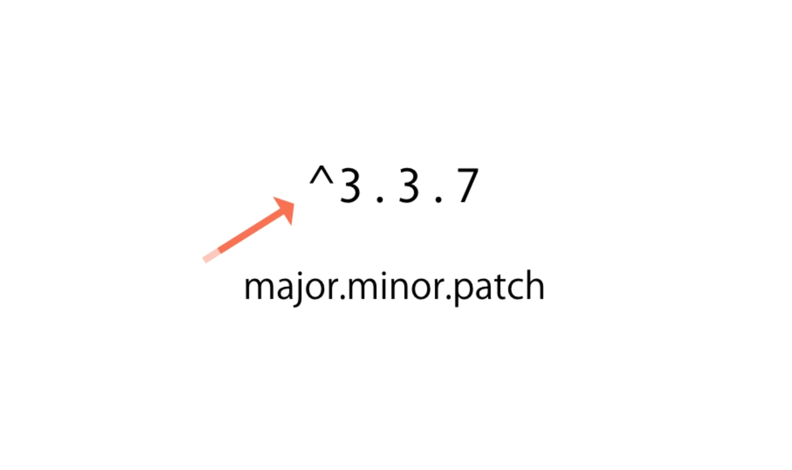
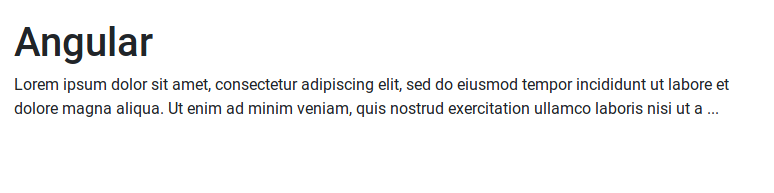
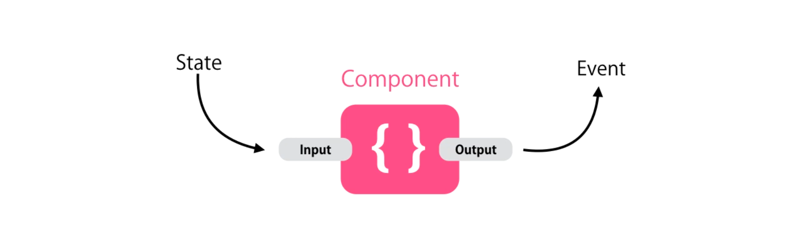

# The Complete Angular Course

## Introduction

### What is Angular JS ?

A framework for building client applications in HTML, CSS, and JavaScript/Typescript

### Why Angular JS ?

When an application become more and more complex, the structure become more complex and hard to maintain. Therefore, as a successful alternative to vanilla JavaScript application, Angular JS can be used to avoid those obstacles.

### Angular JS Benifits

* Gives our application a clean loosely-coupled structure. Easy to understand and maintain.
* Include a lot of reusable code. 
* Introduce more testability. Easy to write automated tests.

## Architecture of Angular Application


Front end : User Data, Presentation logic.

Back end : Database, Processing Data

## Configurations

Node JS. https://nodejs.org

```bash
node --version					# Required minimum NPM version for Angular, v6.9
```

```bash
npm install -g @angular/cli	 	# Install Angular CLI
```

```bash
ng --version					# View Angular version in the console
```

New Project

```bash
ng new <name>					# create a new project named <name>
```

User VS code. https://code.visualstudio.com

Load application

```bash
ng serve -o  					# Serve the app and deploy it in the default web browser
```


**Angular, Angular 2 or Angular 4**

Angular 1 changed completely from Angular 2.


## Typescript Fundamentals

Typescript - A super set of JavaScript (Any supported JS code is also supported in Typescript)

* Strong typing (Static typing)
* Object oriented features - Classes, Access modifiers
* Compile time errors
* Great tools.

### Using Typescript

##### Install TypeScript

```bash
npm install -g typescript
```

The above command will install TypeScript globally (`-g`).

##### Execute TypeScript

```bash
tsc --target es5 filename.ts && node filename.js
```

This command will transpile TypeScript file into JavaScript file and will execute it using node. `--target es5` is for use ECMA script 5 features in the TypeScript file.


## Angular Components

A component encapsulate the data, HTML markup and view logic. Angular defines component based architecture. Angular application is a tree of components. Module is a container for group of components.

**Steps to create and use a component**

* **Create** a component
* **Register** it in a module
* Add an element in an **HTML markup**

## Angular Services


## Angular Data Binding

### Property Binding

We can use property binding to bind **properties of the DOM** as below using `[]`. 

```html
 
```

Here we can use **interpolation** also to set `src` property. But instead using the above property binding is better.

```html

```

Actually, above interpolation is a syntactical sugar. Behind the scene, when angular compiles the templates it translate these interpolations into property bindings. With property binding, we bind a property of a DOM element, to a field where property in our component.

```typescript
@Component({
    selector: 'courses',
    template: ``
})
export class CoursesComponent {
    imageUrl = "http://lorempixel.com/400/200/"
}
```

In the above example `src` property of the `img` DOM element is binded with the `imageUrl` attribute of the `CoursesComponent`.

Even though string interpolation works here, its better to use property binding with DOM element properties. With text elements using interpolation is the better way. 

```html
<h2 [textContent]="title"></h2>
```

But property binding can be used with text also as the above `h2` text content binding.

> **Property binding is only one way . It works only from component to the DOM.**

If we update something in the DOM, component won't be updated. We have to use two way binding for that.


#### DOM vs HTML document

**DOM is a model of objects that represents structure of a document**. Its a **tree of objects in memory**. **HTML is a markup language that we used to represent the DOM in text**. When the browser parses an HTML document, it creates a tree of objects in memory that they refer to as the DOM. We can create that object tree using JavaScript too. But using HTML is far simpler.

**Most of the attributes in the HTML elements has one to one mapping with DOM objects**. But **there are few exceptions**. Some DOM properties are not represented in the HTML attributes and vise versa.  Hence when implementing property binding its better to be careful.


##### HTML Attribute that don't have representation in the DOM

```html
<table>
    <tr>
    	<td [colspan]="colspanOfData"></td>
    </tr>
</table>
```

When we parse this HTML markup, it'll create a actual DOM object. But that DOM object doesn't have property called `colspan`. Thats why the error below pops in the browser console.

```
Error: Template parse errors:
Can't bind to 'colspan' since it isn't a known property of 'td'. ("
        <table>
            <tr>
                <td [ERROR ->][colspan]="colspanOfData"></td>
            </tr>
        </table>
"): ng:///AppModule/CoursesComponent.html@11:20
```


##### DOM attributes that doesn't have representation in the HTML

```javascript
<h1 [textContent]="title"></h1>
```

Here, `textContent` DOM property doesn't have representation in the HTML.


> **When using property binding, actually binding to a property of a DOM object. Not into a attribute of a  HTML element.**

But in 99% cases DOM object properties and HTML element attributes has one to one mapping. There are fewer exceptional scenarios.

### Attribute Binding

To fix the above error, we should say Angular to target the HTML element's attribute rather than targeting a DOM object property as follows that will fix the issue.

```html
<table>
    <tr>
    	<td [attr.colspan]="colspanOfData"></td>
    </tr>
</table>
```

This is called attribute binding.

#### Add bootstrap

The following command will download and install bootstrap and save it into `node_modules` folder and also `--save` will add it as a dependency by adding it to the `package.json`.

```bash
npm install bootstrap --save
```


```json
"dependencies": {
    ...
    "@angular/router": "~7.2.0",
    "bootstrap": "^4.3.1",
    ...
  },
```

Here, the Bootstrap version is showing as `^4.3.1`. That refers to **major.minor.patch** numbers.

****



****

`^` (carrot) character means we can use the most recent major version. According to the above image, we can use 3.4, 3.5, 3.9. But if there is a newer version like version 4 or 5, we are not going to install that through `npm install`.

Why we need to add this to the `package.json`. Because when we using version controlling, we don't need `node_packages` folder there. Instead we simply add `package.json` to the remote repository. Then when someone clones it, and before deploying, he can download all the dependencies for that project via `package.json`. It simply save the space.

And then import bootstrap into the project as follows.

```scss
@import "~bootstrap/scss/bootstrap.scss";		/* 	SCSS 	*/
```

```css
@import "~bootstrap/dist/css/bootstrap.css";	/* 	CSS 	*/
```

Afterwards, we can use bootstrap inside our templates in the regular Bootstrap way as follows.

```typescript
@Component({
    selector: 'courses',
    template: `
        <button class="btn btn-primary">Primary Buttons</button>
    `
})
```


### Class Binding

Angular's, class binding is used to bind the classes into DOM elements dynamically. This is a subset of property binding.

```typescript
@Component({
    ...
    template: `
        <button class="btn btn-primary" [class.active]="isActive">Primary Buttons</button>
    `
    ...
})
export class CoursesComponent {
    isActive = true
}
```

```html
<button class="btn btn-primary active">Primary Buttons</button>
```

According to the above code, only if `isActive` is true, `button` will be added with `active` class. If `isActive` is false then `active` class won't be added into the element. 


> [JavaScript false and true conditions](https://developer.mozilla.org/en-US/docs/Glossary/Truthy)
>
> In JavaScript, a **truthy** value is a value that is considered  `true` when encountered in a boolean context. All values are truthy unless they are defined as falsy (i.e., except for `false`, `0`, `""`, `null`, `undefined`, and `NaN`).
>
> JavaScript uses type [coercion](https://developer.mozilla.org/en-US/docs/Glossary/Type_Conversion) in Boolean contexts.
>
> Examples of *truthy* values in JavaScript (which will be coerced to true in boolean contexts, and thus execute the `if` block):
> ```js
> if (true)
> if ({})
> if ([])
> if (42)
> if ("0")
> if (new Date())
> if (-42)
> if (12n)
> if (3.14)
> if (-3.14)
> if (Infinity)
> if (-Infinity)
> ```


### Style Binding

Angular will use style binding to apply CSS styles dynamically into DOM elements as follows. This is also a variation of property binding. We can use [DOM style objects properties](https://www.w3schools.com/jsref/dom_obj_style.asp) in style binding.

```html
<button [style.backgroundColor]="isActive ? 'blue' : 'grey' ">Primary Buttons</button>
```

Note, that there is `''` for the applying string style attribute values. 

### Event Binding

Event binding is used to bind events with the component. In the below code snippet, buttons click event is attached with `onSave` function of the component. `$event` is the event objects, that is passed as a input argument to the method. 

```typescript
@Component({
    selector: 'courses',
    template: `
        <button (click)="onSave($event)">Primary Buttons</button>
    `
})
export class CoursesComponent {
    ...

    onSave($event){
        console.log("Button Clicked!", $event)
    }
}
```

#### Event Bubbling & preventing

Event bubbling is the standard event propagation mechanism in the DOM. It will start from the child and propagate to the parent and so on.

```typescript
@Component({
    selector: 'courses',
    template: `
        <div (click)="clickDiv()">
            <button (click)="onSave($event)">Primary Buttons</button>
        </div>
    `
})
export class CoursesComponent {
    
    onSave($event){
        console.log("Button Clicked!", $event)
    }

    clickDiv(){
        console.log("Div Clicked!")
    }
}
```

Above example will propagate event as follows. 

```
Button Clicked! 
Div Clicked!
```

To prevent event prorogation, we can change the method as follows using `$event.stopPropagation()` standard JS method.

```javascript
 onSave($event){
 	$event.stopPropagation();
 	console.log("Button Clicked!", $event)
 }
```


#### Event Filtering

Event filtering is used to filter events when implementing event binding. According to the following example, `(keyUp.enter)` event filter is used, instead of `(keyUp)` event and filtering `enter` event at the component method afterwards.

```typescript
@Component({
    selector: 'courses',
    template: `
    	<h1 [textContent]="title"></h1>
    	<h2>{{subTitle}}</h2>
        <input (keyUp.enter)="onKeyUp()"/>
		// <input (keyUp)="onKeyUp($event)"/> Not This
    `
})

export class CoursesComponent {
    title = "Angular"
    subTitle = "Event Filtering"
    
    // Use this.
    onKeyUp(){
        console.log("ENTER has pressed!")
    }
    
    // Not this.
    onKeyUp($event){
        if ($event.keyCode === 13){
            console.log("ENTER has pressed!")
        }
    }
}
```

#### Template Variables

Access the value of the element

**Use the `$event` object**

```typescript
import { Component } from '@angular/core'

@Component({
    selector: 'courses',
    template: `
    	<h1 [textContent]="title"></h1>
    	<h2>{{subTitle}}</h2>
        <input (keyUp.enter)="onKeyUp($event)"/>
    `
})
export class CoursesComponent {
    title = "Angular"
    subTitle = "Using $event Object to pass the value"
	// pass the standerd event object to access value of the element.
    onKeyUp($event){
        console.log($event.target.value)
    }
}
```

**Using the template variable**

Here, instead of passing `$event` object to the method, we refer that element by using a template variable `#email`. Then, the value of that variable is passed to the method as input argument.

```typescript
import { Component } from '@angular/core'

@Component({
    selector: 'courses',
    template: `
    	<h1 [textContent]="title"></h1>
    	<h2>{{subTitle}}</h2>
        <input #email (keyUp.enter)="onKeyUp(email.value)"/>
    `
})
export class CoursesComponent {
    title = "Angular"
    subTitle = "Template Variable to pass the value"

    onKeyUp(email){
        console.log(email)
    }
}
```


### Two way binding

Alternative way for two way binding using `$event` object expression.

```typescript
import { Component } from '@angular/core'

@Component({
    selector: 'courses',
    template: `
        <input [value]="email" (keyUp.enter)="email = $event.target.value; onKeyUp()"/>
    `
})
export class CoursesComponent {
    
    email = "do@angular.com"

    onKeyUp(){
        console.log(this.email)
    }
}
```

Standard way using `@NgModel` directive. Here `[(ngModel)]="email"` defines the two way binding of the `email` field of the component.  

```typescript
import { Component } from '@angular/core'

@Component({
    selector: 'courses',
    template: `
        <input [(ngModel)]="email" (keyUp.enter)="onKeyUp()"/>
    `
})
export class CoursesComponent {
    
    email = "do@angular.com"

    onKeyUp(){
        console.log(this.email)
    }
}
```

If there is a error like follows, its because we need to import forms module, because its where `@NgModel` is available.

```
Error: Template parse errors: Can't bind to '(ngModel))' since it isn't a known property of 'input'. (" <input [value]="email" (keyUp.enter)="email = $event.target.value; onKeyUp()"/>
```

```typescript
import { BrowserModule } from '@angular/platform-browser';
import { FormsModule} from '@angular/forms';

@NgModule({
  ...
  imports: [
    BrowserModule,
    FormsModule
  ],
  ...
})
export class AppModule { }

```

### Pipes

**Angular pipes is used to format the data for the view**. There are built in pipes for  Uppercase, Lowercase, Decimal, currency, percent. Also we can create custom pipes.

```typescript
import { Component } from '@angular/core'

@Component({
    selector: 'courses',
    template: `
        <h3>{{course.title | uppercase | lowercase }}</h3><br>  // Apply multiple pipes
        {{course.students | number }}<br>						// Rounding of the Number
        {{course.rating | number:'2.1-1' }}<br>					// Leading zero, Rounding
        {{course.price | currency:'AUD':true:'3.2-2' }}<br>		// Price format
        {{course.releaseDate | date:'shortDate'}}				// Date Format
    `
})
export class CoursesComponent {
    title = "Angular Pipes"
    course = {
        title: "The complete Angular Course",
        rating: 4.9745,
        students: 23456,
        price: 190.49,
        releaseDate: new Date(2019, 8, 1)
    }
}
```


#### Custom pipes

Create a new file for the pipe. In this case `summary.pipe.ts` as below is created for a pipe that take text content and summarize them for a given length. Here, we use `Pipe`  decorator and `PipeTransform` interfaces from the core and we implement it's `transform` it in our custom pipe.

```typescript
import {Pipe, PipeTransform} from '@angular/core'

@Pipe({ name: 'summary'})
export class SummaryPipe implements PipeTransform {
    transform(value: string, limit?: number){   
        if(!value) return null
        let actualLimit = (limit) ? limit : 50
        return value.substring(0, actualLimit) + ' ...'
    }
}
```


> ##### Insight into Angular Pipes
>
> Pipe decorator has 2 properties, `name`, `pure`.
>
> | Option                                          | Description                                                  |
> | ----------------------------------------------- | ------------------------------------------------------------ |
> | [`name`](https://angular.io/api/core/Pipe#name) | <small>`name: string`  The pipe name to use in template bindings. </small> |
> | [`pure`](https://angular.io/api/core/Pipe#pure) | <small>`pure: boolean` When true, the pipe is pure, meaning that the `transform()` method is invoked only when its input arguments change. Pipes are pure by default. <br>If the pipe has internal state (that is, the result depends on state other than its arguments), set `pure` to false. In this case, the pipe is invoked on each change-detection cycle, even if the arguments have not changed.</small> |
>
> We need to implement `PipeTransform` interface when we create a pipe. This interface has only one method, `transform`.
>
> ```typescript
> interface PipeTransform {
> transform(value: any, ...args: any[]): any
> }
> ```
>
> ###### Parameters
>
> | Field | value | args  | Returns |
> | ----- | ----- | ----- | ------- |
> | Type  | any   | any[] | any     |
>
> <small>Refer [Angular.io | Pipes](https://angular.io/guide/pipes) for more about pipes. </small>

We can use above created `summary` pipe as below. First we need to import the custom pipe into our module in order to use it.

```typescript
...
import { SummaryPipe } from './summary.pipe';

@NgModule({
  declarations: [
    ...,
    SummaryPipe
  ],
  imports: []
  ...
```

Then we can use it in our component.

```typescript
import { Component } from '@angular/core'

@Component({
    selector: 'courses',
    template: `
        {{paragraph | summary:100}}
    `
})
export class CoursesComponent {
    paragraph = "Lorem ipsum dolor sit amet, consectetur adipiscing elit, sed do eiusmod tempor incididunt ut labore et dolore magna aliqua. Ut enim ad minim veniam, quis nostrud exercitation ullamco laboris nisi ut aliquip ex ea commodo consequat. Duis aute irure dolor in reprehenderit in voluptate velit esse cillum dolore eu fugiat nulla pariatur. Excepteur sint occaecat cupidatat non proident, sunt in culpa qui officia deserunt mollit anim id est laborum."
}
```

This will output summery result in the web browser as below.



## Building Reusable Components 

In order to make component more reusable, we want to add bunch of input and output properties. We use input properties pass input to the state of the component. We use output properties to raise events from this custom components. **The combination of input and output properties for a component**, make up the **public API of that component**. 




## Angular Directives

There are two type of inbuilt directives in the Angular JS.

* Structural Directives
* Attribute Directives

### Structural Directives

#### `ngIf` Directive


#### `ngFor` Directive

```html
<ul>
    <li *ngFor="let course in courses; index as i; even as isEven">
    	{{i}} - {{ course.name }} -- {{isEven}}
    </li>
</ul>
```


#### `ngSwitch` Directive


### Custom Directives


#### Whats not here.

* End to end tests. (e2e)
* Karma Angular Testing